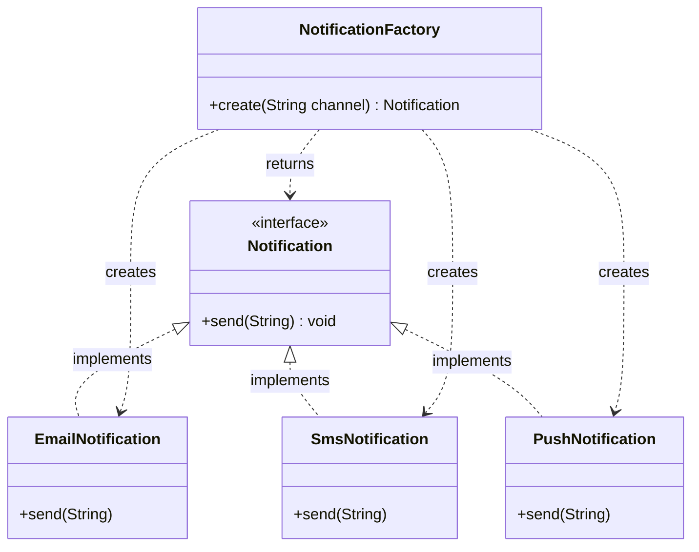

# Factory Method — Class / ER Diagram

## Class / ER diagram (Mermaid)



## The relationships in plain English

Two families of relationship to point at on screen:

- **"is-a" (realization / the dashed triangle arrows):** `EmailNotification`, `SmsNotification`, and `PushNotification` all *implement* the `Notification` interface. To the outside world they're interchangeable — anyone holding a `Notification` can call `send()` without caring which one it really is.
- **"creates" (dependency / the dashed arrows out of the factory):** `NotificationFactory` knows about all three concrete classes and decides which one to build. This is the *one place* in the system that says `new`.

The key move: the **client depends only on the interface and the factory**, never on the concrete classes. So concrete classes can come and go, and client code never changes. That decoupling is the entire value of the pattern.

If you think of it as an ER model: one "product type" entity (`Notification`) with several concrete "rows," and a factory entity that maps a *key* (the channel string) to the right row.

## The code

Implementation lives in [`src/`](src/). Compile and run the demo:

```bash
cd src && javac *.java && java Demo
# or from the repo root:  ./run.sh 02-factory-pattern
```
