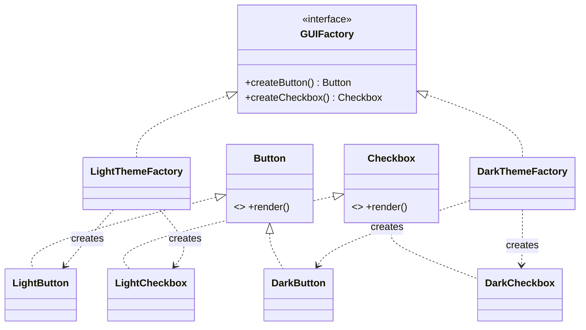

# Abstract Factory — Class / ER Diagram

## Class / ER diagram (Mermaid)



## The relationships in plain English

This is Factory Method "leveled up." Where Factory Method makes *one* kind of product, Abstract Factory makes a **matching family** of products.

- **Two product hierarchies:** `Button` and `Checkbox`, each an interface with light/dark implementations. These are the *products*.
- **One factory hierarchy:** `GUIFactory` with two concrete factories, `LightThemeFactory` and `DarkThemeFactory`. Each factory knows how to build *every product in its own family*.
- **The guarantee (the important relationship to say out loud):** because a single factory builds both the button and the checkbox, they're *always from the same theme*. You cannot accidentally pair a light button with a dark checkbox — the factory won't let you. Consistency is enforced by construction.

ER framing: think of it as two related tables (`Button`, `Checkbox`) that must share the same `theme` foreign key. The factory is the thing that guarantees the foreign keys match.

## The code

Implementation lives in [`src/`](src/). Compile and run the demo:

```bash
cd src && javac *.java && java Demo
# or from the repo root:  ./run.sh 03-abstract-factory-pattern
```
