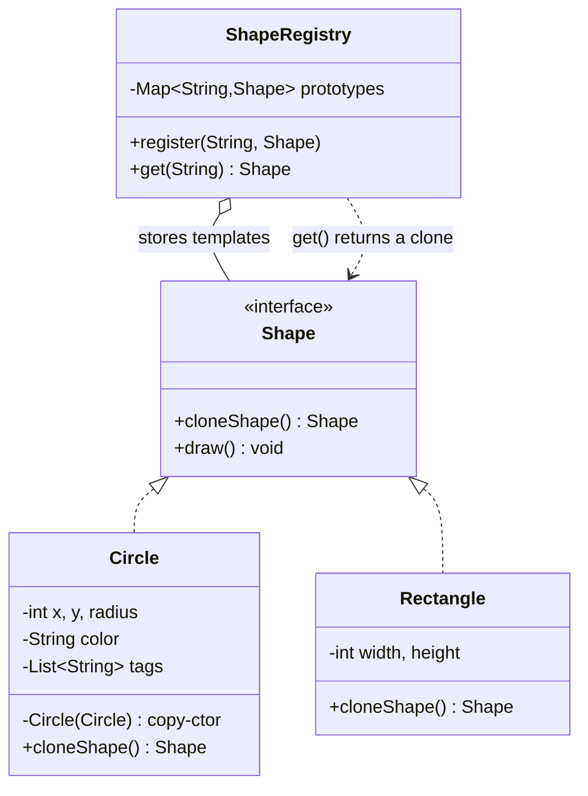

# Prototype — Class / ER Diagram

## Class / ER diagram (Mermaid)



## The relationships in plain English

- **`cloneShape()` is the contract:** every `Shape` promises "I can produce an independent copy of myself." The client copies an *existing* object instead of calling `new` and reconfiguring from scratch.
- **The copy constructor does the real work** (`Circle(Circle other)`). It copies each field — and, crucially, makes a **new list** for `tags` rather than copying the reference. That's the deep-copy vs shallow-copy distinction, the single most important thing to get right in this pattern.
- **`ShapeRegistry` holds templates** (aggregation, the open diamond) and hands out clones (`get()` returns `prototype.cloneShape()`). Callers depend only on the registry and the `Shape` interface.

ER framing: the registry is a table of "template rows"; `get()` performs an *insert-as-copy* — a brand-new row with the same values, but its own identity.

## Shallow vs deep copy

- **Shallow copy:** copies the reference to `tags`. Original and clone share the *same* list → editing one edits both. Bug.
- **Deep copy:** `new ArrayList<>(other.tags)` → the clone gets its own list. Independent. ✅
- The demo proves it: after cloning and adding tags to the copies, the original template still reads `tags=[template]`.

## The code

Implementation lives in [`src/`](src/). Compile and run the demo:

```bash
cd src && javac *.java && java Demo
# or from the repo root:  ./run.sh 05-prototype-pattern
```
