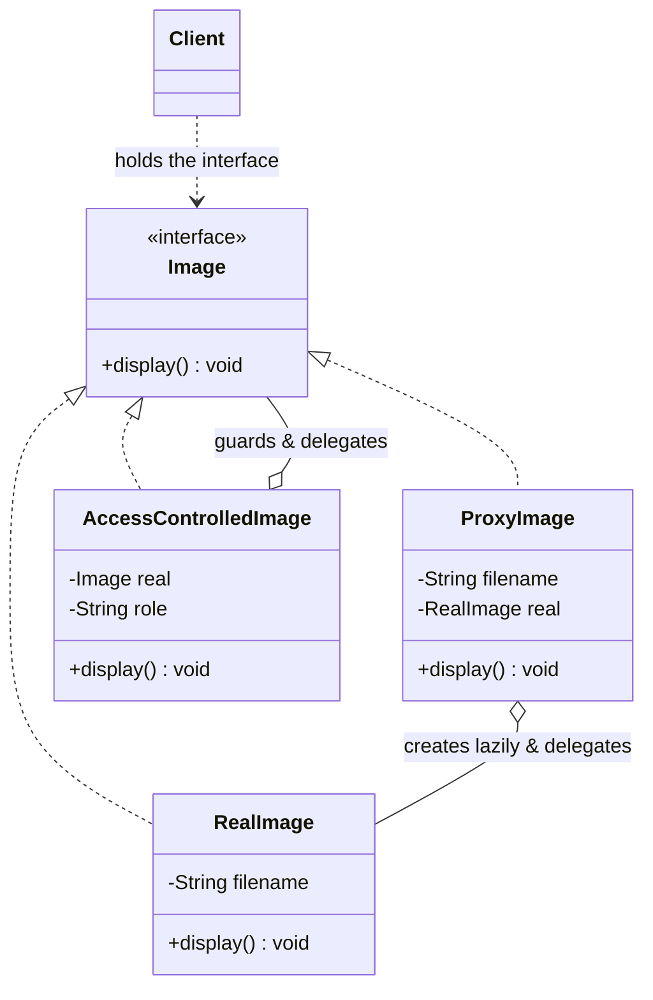

# Proxy — Class / ER Diagram

## Class / ER diagram (Mermaid)



## The relationships in plain English

- **Same interface, both sides.** `RealImage` and `ProxyImage` both implement `Image`. That's the defining rule of Proxy — the stand-in looks *identical* to the real thing, so the client can swap one for the other and never notice.
- **The proxy holds the real object** (aggregation) and **delegates** to it — but it wraps that delegation in something extra: lazy creation, an access check, caching, logging, a network call.
- **Two flavors shown:**
  - `ProxyImage` = **virtual proxy** — defers the expensive `RealImage` creation until the first `display()`, then reuses it.
  - `AccessControlledImage` = **protection proxy** — checks the caller's role before delegating; refuses if unauthorized.

The one-line relationship to say out loud: *a proxy is a stand-in that has the same face as the real object but controls when and how you reach it.*

## Proxy vs Decorator vs Facade

- **Proxy:** same interface, *controls access* to one object (lazy/guard/remote/cache). You usually don't even know it's not the real thing.
- **Decorator:** same interface, *adds behavior*, meant to be stacked.
- **Facade:** *new, simpler* interface over *many* objects.

Shape is similar (wrapping); intent differs. Interviewers probe this constantly.

## The code

Implementation lives in [`src/`](src/). Compile and run the demo:

```bash
cd src && javac *.java && java Demo
# or from the repo root:  ./run.sh 09-proxy-pattern
```
