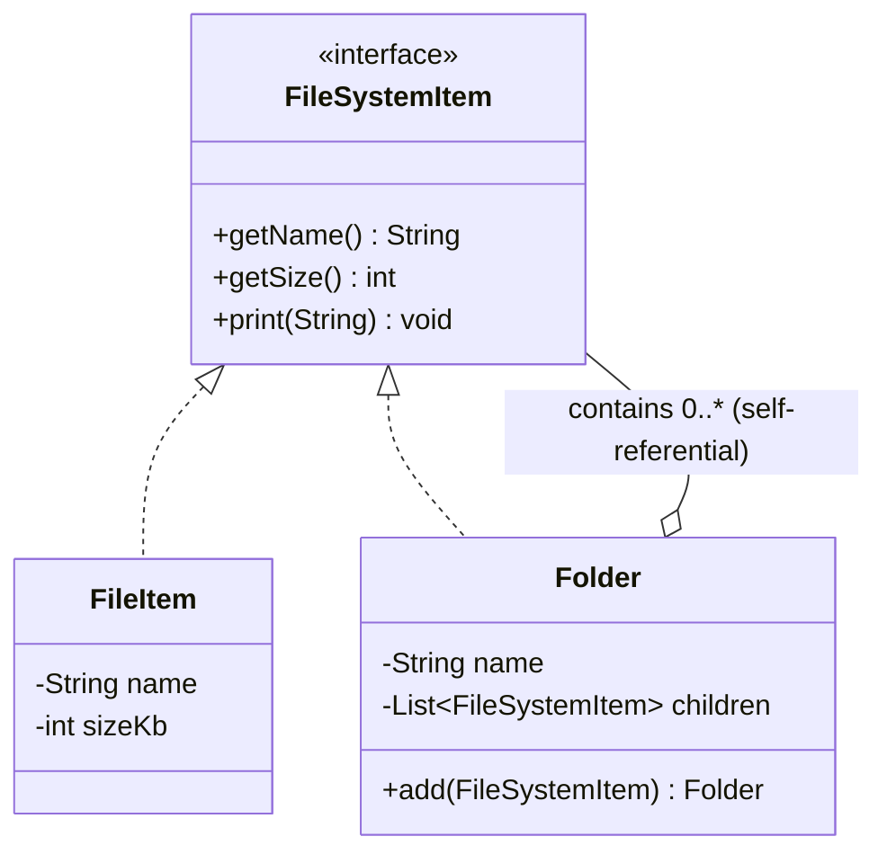

# Composite — Class / ER Diagram

## Class / ER diagram (Mermaid)



## The relationships in plain English

- **One interface for two kinds of thing.** `FileItem` (a *leaf* — no children) and `Folder` (a *composite* — has children) both implement `FileSystemItem`. So the client holds `FileSystemItem` and never has to ask "is this a file or a folder?"
- **The self-referential relationship is the whole pattern.** A `Folder` holds a list of `FileSystemItem` — and because `Folder` *is* a `FileSystemItem`, a folder can contain other folders. That "contains its own type" loop is what builds a tree of any depth.
- **Recursion falls out for free.** `Folder.getSize()` just sums `child.getSize()` over its children. If a child is a file, it returns its own size; if it's a folder, it recurses. The client calls `getSize()` once on the root and the whole tree computes itself.

ER framing: this is the classic **self-referencing table** — a `node` row with an optional `parent_id` pointing at another `node`. Files are rows with no children; folders are rows that other rows point to. Composite is that idea in objects.

## The code

Implementation lives in [`src/`](src/). Compile and run the demo:

```bash
cd src && javac *.java && java Demo
# or from the repo root:  ./run.sh 10-composite-pattern
```
