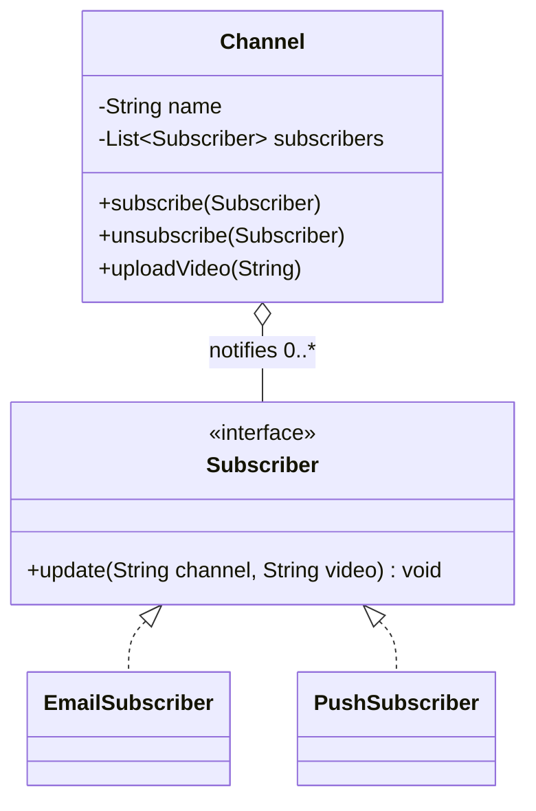

# Observer — Class / ER Diagram

## Class / ER diagram (Mermaid)



## The relationships in plain English

- **Subject → many observers (one-to-many).** The `Channel` (the *subject* / *observable*) holds a list of `Subscriber`s and pushes an event to all of them when a video drops. That one-to-many "when I change, everyone hears about it" link is the pattern.
- **The subject depends only on the interface.** `Channel` knows its subscribers as `Subscriber` — never as `EmailSubscriber` or `PushSubscriber`. So it has *no idea* who's listening or what they do with the news. You can add a new kind of subscriber without touching the channel at all. That loose coupling is the payoff.
- **Observers react independently.** Given the same event, the email subscriber sends an email and the push subscriber fires a notification. Same signal, different reactions, all decoupled.
- **Subscribe / unsubscribe are dynamic.** Observers register and leave at runtime; the demo shows Bob unsubscribing and simply stops getting updates.

ER framing: a classic one-to-many — one `channel` row, many `subscription` rows pointing back to it. Publishing walks the subscriptions and pings each subscriber.

## Push vs pull

- **Push** (what we use): the subject sends the data *with* the notification (`update(channel, video)`).
- **Pull:** the subject just says "something changed," and each observer calls back to fetch what it needs. Useful when different observers need different slices of state.

## The code

Implementation lives in [`src/`](src/). Compile and run the demo:

```bash
cd src && javac *.java && java Demo
# or from the repo root:  ./run.sh 11-observer-pattern
```
