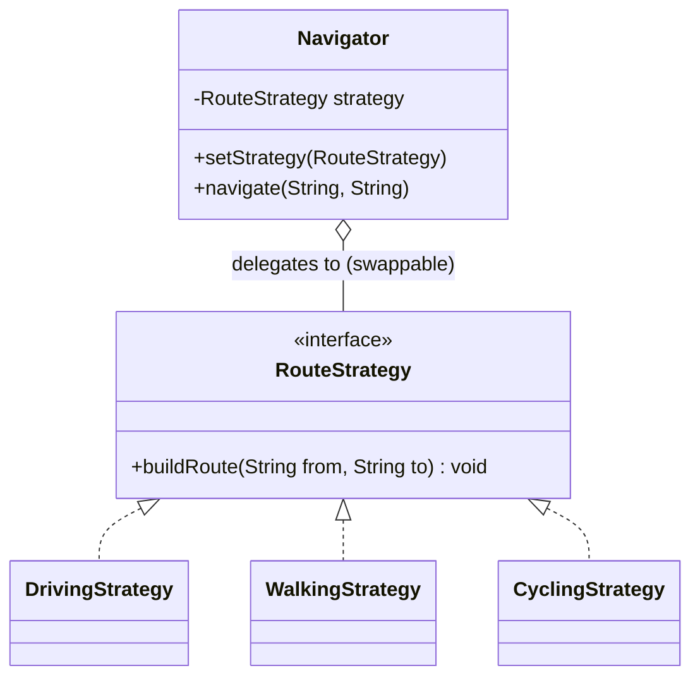

# Strategy — Class / ER Diagram

## Class / ER diagram (Mermaid)



## The relationships in plain English

- **Context has-a strategy.** The `Navigator` (the *context*) holds a `RouteStrategy` and *delegates* the actual work to it. The context defines *when* the algorithm runs; the strategy defines *how*.
- **Interchangeable algorithms.** `DrivingStrategy`, `WalkingStrategy`, `CyclingStrategy` all implement the same interface, so they're drop-in replacements for each other. The context can hold any of them and call the same method.
- **Swappable at runtime.** `setStrategy(...)` changes the algorithm on the fly — tap "Walk," the strategy object changes, the next `navigate()` behaves differently. No conditionals in the context.

The one-liner: Strategy replaces a big `if/else` (or `switch`) over "which algorithm" with a set of interchangeable objects you plug into a context. Adding a new algorithm = a new class, not a new branch.

ER framing: the context row has a foreign key to a "strategy" row; changing the FK changes the behavior.

## Strategy vs the if/else it replaces

```java
// BEFORE — the smell
if (mode.equals("driving"))      { /* driving logic */ }
else if (mode.equals("walking")) { /* walking logic */ }
else if (mode.equals("cycling")) { /* cycling logic */ }
// ...every new mode = edit this method

// AFTER — Strategy
navigator.setStrategy(strategyFor(mode));
navigator.navigate(from, to);
```

## Strategy vs State

Same diagram shape (context + pluggable objects), different intent:
- **Strategy:** the *client* picks the algorithm; strategies usually don't know about each other.
- **State:** the object changes its *own* state internally; states often trigger transitions to other states.

## The code

Implementation lives in [`src/`](src/). Compile and run the demo:

```bash
cd src && javac *.java && java Demo
# or from the repo root:  ./run.sh 12-strategy-pattern
```
