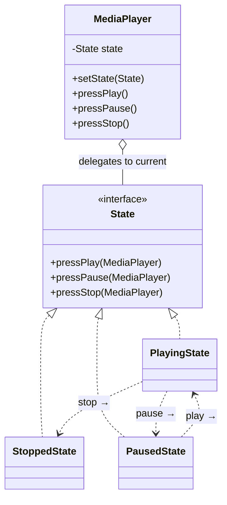
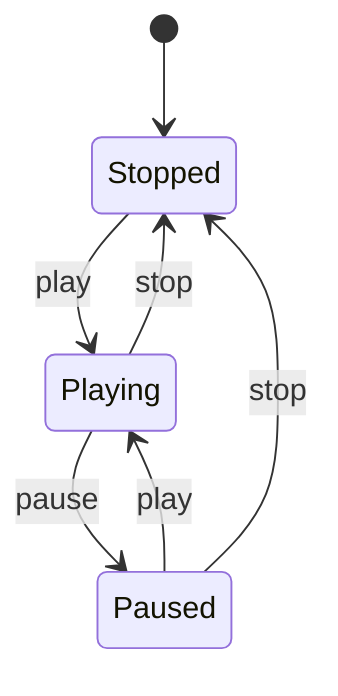

# State — Class / ER Diagram

## Class / ER diagram (Mermaid)



## State transition diagram



## The relationships in plain English

- **Context has-a current state.** The `MediaPlayer` holds one `State` and delegates every button press to it. The player itself has *no* if/else about "am I playing or paused?" — that knowledge moved into the state objects.
- **Each state owns its behavior AND its transitions.** `PlayingState.pressPause()` prints "pausing" *and* swaps the player to `PausedState`. So the states form a little graph, pointing at each other (`Playing → Paused → Playing → Stopped`). That self-directed transition is what separates State from Strategy.
- **Same button, different outcome.** Pressing play in `StoppedState` starts playback; pressing play in `PlayingState` does nothing. Identical call, different behavior — because the current state decides.

The one-liner: State replaces a sprawling `if (mode == PLAYING) … else if (mode == PAUSED) …` in every method with one class per state, each handling its own behavior and deciding what comes next.

## State vs Strategy

Same diagram shape (context + pluggable objects), different intent:
- **Strategy:** the *client* picks the algorithm; strategies are independent and don't switch to each other.
- **State:** the object transitions *itself* between states; states know about and move to other states.

## The code

Implementation lives in [`src/`](src/). Compile and run the demo:

```bash
cd src && javac *.java && java Demo
# or from the repo root:  ./run.sh 15-state-pattern
```
