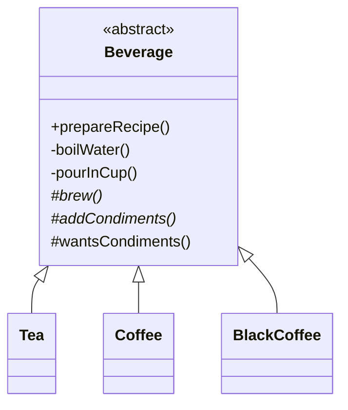

# Template Method — Class / ER Diagram

## Class / ER diagram (Mermaid)



## The relationships in plain English

This is the one pattern in the behavioral group built on **inheritance**, not composition.

- **The base class owns the algorithm's skeleton.** `prepareRecipe()` is the *template method*: it calls the steps in a fixed order — boil, brew, pour, (maybe) condiments. It's marked `final` so subclasses **cannot reorder or replace** the overall flow.
- **Steps come in three flavors:**
  - **Concrete steps** (`boilWater`, `pourInCup`) — shared by all beverages, written once in the base class. This is the DRY win.
  - **Abstract steps** (`brew`, `addCondiments`) — the parts that *must* vary. Subclasses are forced to implement them.
  - **Hooks** (`wantsCondiments`) — optional steps with a default the subclass *may* override to tweak the skeleton (e.g. black coffee skips condiments).
- **Subclasses fill in the blanks, nothing more.** `Tea` and `Coffee` only supply `brew` and `addCondiments`. They can't change the order — that guarantee lives in the parent.

The one-liner: *"Don't call us, we'll call you."* — the base class calls down into the subclass's step implementations (the Hollywood Principle), the inverse of a normal library where you call in.

## Template Method vs Strategy

- **Template Method:** skeleton fixed in a base class, steps overridden via **inheritance** (compile-time).
- **Strategy:** whole algorithm swapped via **composition** (runtime).

Same goal (vary part of an algorithm), different mechanism.

## The code

Implementation lives in [`src/`](src/). Compile and run the demo:

```bash
cd src && javac *.java && java Demo
# or from the repo root:  ./run.sh 16-template-method-pattern
```
