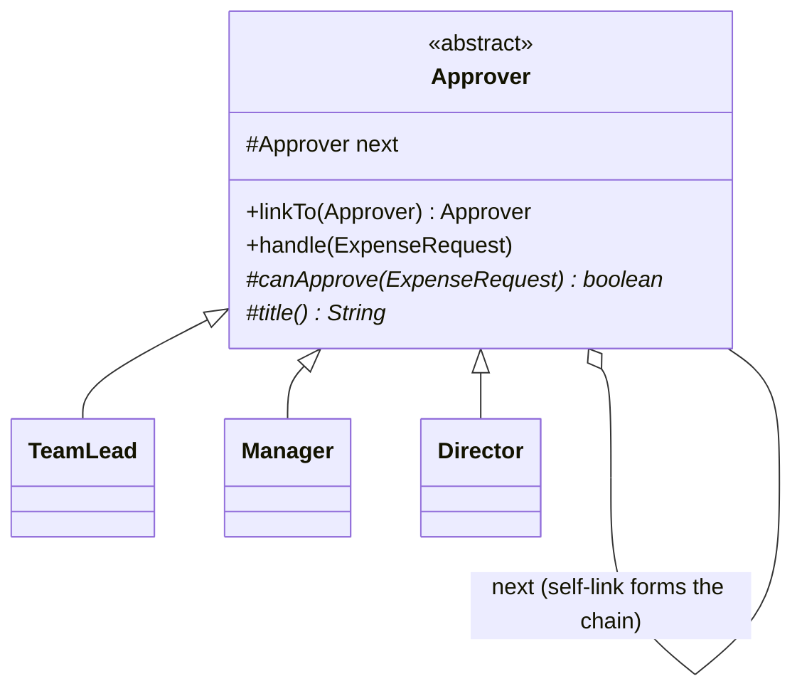

# Chain of Responsibility — Class / ER Diagram

## Class / ER diagram (Mermaid)



## The relationships in plain English

- **The self-link is the pattern.** Each `Approver` holds a reference to the *next* `Approver` (`next`). Wire several together — `TeamLead → Manager → Director` — and you've built a chain. That "handler points to another handler of the same type" is the defining relationship.
- **Handle-or-pass.** In `handle()`, an approver either deals with the request (`canApprove` is true) or forwards it to `next`. The request travels down the chain until someone handles it — or it falls off the end unhandled.
- **The sender is decoupled from the receiver.** The demo always calls `teamLead.handle(req)` — it enters at the front and never decides *who* will actually approve. Add or reorder approvers and the calling code doesn't change. That decoupling is the win.

ER framing: it's a **linked list** of handlers — each node has a `next` pointer, and the request walks the list. Same shape as a self-referencing `handler(id, next_id)` table.

## Variations to mention

- **Stop at first handler** (what we do): the first approver who can, does; the rest never see it.
- **Everyone gets a turn:** the request passes through *all* handlers (e.g. a middleware/filter pipeline where each logs, authenticates, compresses). Servlet filters and Spring interceptor chains work this way.

## The code

Implementation lives in [`src/`](src/). Compile and run the demo:

```bash
cd src && javac *.java && java Demo
# or from the repo root:  ./run.sh 17-chain-of-responsibility-pattern
```
