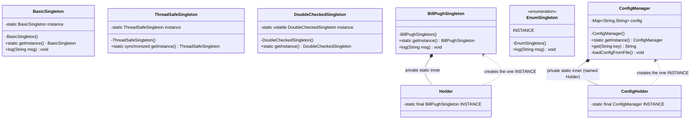
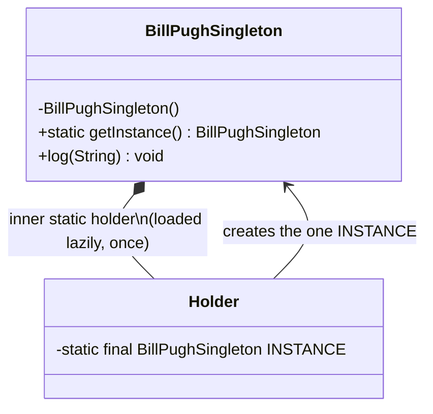

# Singleton — Class / ER Diagram

## Class / ER diagram



Bill Pugh variant (the one we recommend on screen):



## The relationships in plain English

There's really only one class here, and the interesting relationship is the one it has **with itself**. A Singleton *holds a reference to its own single instance* in a `static` field. That self-reference is the whole trick — the class is both the factory and the product.

- **`instance` (static field)** → this is the shared object. Because it's `static`, it belongs to the *class*, not to any object, so there is exactly one slot for it in memory.
- **`Singleton()` (private constructor)** → the "locked front door." The arrow that would normally come from *any other class* saying `new Singleton()` is deliberately cut. Nobody outside can construct one.
- **`getInstance()` (public static method)** → the "one door in." Every caller goes through here and gets the same object back.

In the Bill Pugh version, add one more relationship: the outer class **contains** a private inner `Holder` class (composition, the filled diamond). The JVM only loads `Holder` the first time `getInstance()` touches it — that lazy, thread-safe class-loading is what gives us safety for free.

There is no traditional "ER" (entity-relationship) here because Singleton is a single node — but framing it as *"one entity that owns exactly one row of itself"* is the mental model to say out loud.

## The code

Implementation lives in [`src/`](src/). Compile and run the demo:

```bash
cd src && javac *.java && java Demo
# or from the repo root:  ./run.sh 01-singleton-pattern
```
