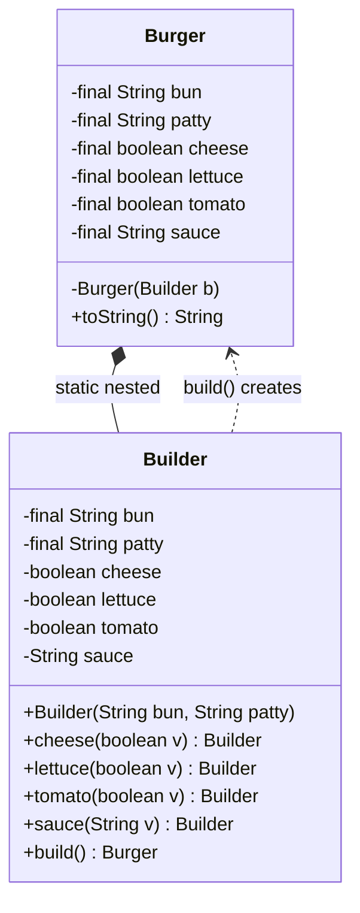

# Builder — Class / ER Diagram

## Class / ER diagram



## The relationships in plain English

- **`Builder` is a static nested class of `Burger`** (the composition/containment link). That's what lets the builder reach `Burger`'s private constructor. Nobody else can — so the *only* path to a `Burger` runs through the `Builder`.
- **Fluent chaining:** every optional setter (`cheese`, `lettuce`, …) returns `this` — the same builder — so calls chain into one readable sentence: `.cheese(true).lettuce(true).build()`.
- **Required vs optional split:** required fields (`bun`, `patty`) go in the `Builder`'s *constructor*, so you can't even start building without them. Optional fields are chainable setters. Validation lives in `build()` — the object fails *before* it exists, never in a half-built state.
- **Immutability:** all `Burger` fields are `final`. Once `build()` returns, the object can't change. The mutable "scratchpad" is the builder; the product is frozen.

ER framing: the builder is a *draft row* you edit freely; `build()` commits it to an immutable *final row*.

## The code

Implementation lives in [`src/`](src/). Compile and run the demo:

```bash
cd src && javac *.java && java Demo
# or from the repo root:  ./run.sh 04-builder-pattern
```
