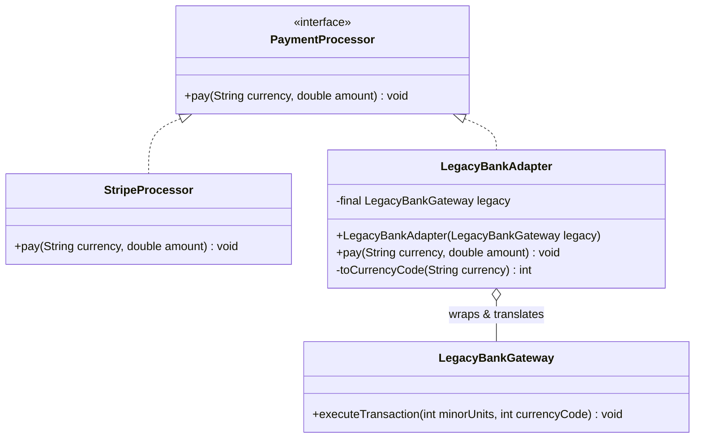

# Adapter — Class / ER Diagram

## Class / ER diagram



## The relationships in plain English

Three roles — name them on screen:

- **Target** (`PaymentProcessor`): the clean interface your app *wants* to call.
- **Adaptee** (`LegacyBankGateway`): the existing, incompatible thing you *can't change* — a third-party lib, a legacy system, someone else's API. Its method name, parameter types, and units are all different.
- **Adapter** (`LegacyBankAdapter`): implements the *Target* and **holds a reference to the Adaptee** (the open-diamond aggregation). Every call to the target method gets *translated* into the adaptee's language.

The single most important relationship: the adapter **implements one side and wraps the other**. It speaks "modern app" on the outside and "legacy gateway" on the inside, converting between them — dollars → cents, `"USD"` → `840`, `pay(...)` → `executeTransaction(...)`.

Contrast on screen: `StripeProcessor` implements the target *directly* — it already speaks the right language, so it needs no adapter. That contrast makes the adapter's job obvious.

## The code

Implementation lives in [`src/`](src/). Compile and run the demo:

```bash
cd src && javac *.java && java Demo
# or from the repo root:  ./run.sh 06-adapter-pattern
```
