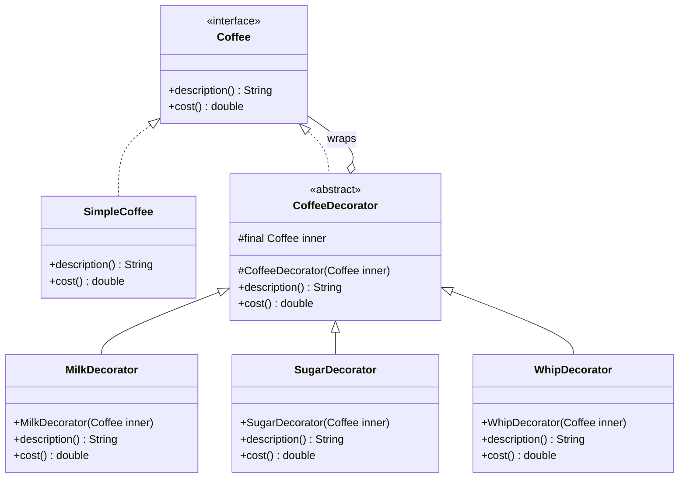

# Decorator — Class / ER Diagram

## Class / ER diagram



## The relationships in plain English

The whole trick is one class that is **both** an "is-a" and a "has-a":

- **is-a:** `CoffeeDecorator` implements `Coffee`. So a decorator *is* a coffee — anyone holding a `Coffee` can use a decorated one without knowing.
- **has-a:** `CoffeeDecorator` holds a `Coffee` (`inner`). So a decorator *wraps* another coffee.

Put those together and decorators can wrap decorators. `Whip(Sugar(Milk(SimpleCoffee)))` is a coffee wrapped in milk wrapped in sugar wrapped in whip. Each layer calls the layer inside it (`inner.cost()`) and adds its own bit on top. The call ripples inward to the base, then each layer adds its piece on the way back out.

Contrast with inheritance (say this): to get every combo by subclassing you'd need `CoffeeWithMilk`, `CoffeeWithMilkAndSugar`, `CoffeeWithMilkSugarWhip`… a combinatorial explosion. Decorator gives you all combinations from a handful of small classes, chosen **at runtime**.

ER framing: it's a self-referential relationship — a `Coffee` that optionally *contains another* `Coffee`, forming a linked chain from outermost decorator down to the base.

## The code

Implementation lives in [`src/`](src/). Compile and run the demo:

```bash
cd src && javac *.java && java Demo
# or from the repo root:  ./run.sh 07-decorator-pattern
```
