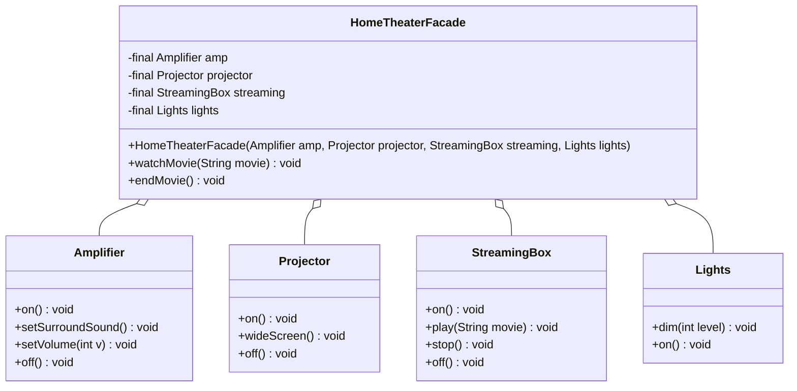

# Facade — Class / ER Diagram

## Class / ER diagram



## The relationships in plain English

- **The facade holds the subsystems** (the four open-diamond aggregations). It knows about the amplifier, projector, streaming box, and lights — and, importantly, it knows the *correct order* to operate them in.
- **The client depends only on the facade** (the single dashed arrow). It no longer has four dependencies — it has one. That collapse from many arrows to one arrow *is* the pattern.
- **Facade doesn't hide or forbid the subsystems.** They're still there and still usable directly for power users. The facade just offers an easy, correct default path for the common case.

The key contrast to draw: *before*, the client has arrows pointing at all four subsystems and must know their order and quirks. *After*, the client points at one box, and all that knowledge lives inside the facade.

ER framing: think of the facade as a *view* over several tables — it presents one clean surface while the complexity of the underlying tables (subsystems) stays hidden.

## Facade vs Adapter

- **Facade:** simplifies *many* classes behind *one* easy interface. Goal = ease of use.
- **Adapter:** makes *one* incompatible interface fit *one* expected interface. Goal = compatibility.

Different problems that both involve "wrapping."

## The code

Implementation lives in [`src/`](src/). Compile and run the demo:

```bash
cd src && javac *.java && java Demo
# or from the repo root:  ./run.sh 08-facade-pattern
```
