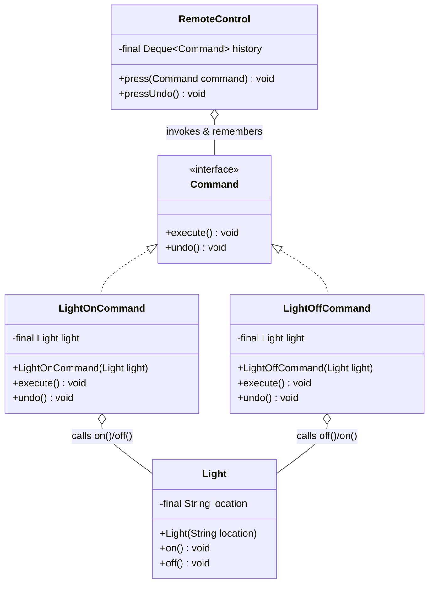

# Command — Class / ER Diagram

## Class / ER diagram



## The relationships in plain English

Four roles — name each on screen:

- **Command** (interface): wraps a request as an object — `execute()` plus `undo()`.
- **Concrete Command** (`LightOnCommand`): binds *an action* to *a receiver*. It holds a `Light` and knows that "execute" means `light.on()` and "undo" means `light.off()`.
- **Receiver** (`Light`): the thing that actually does the work. Commands delegate to it.
- **Invoker** (`RemoteControl`): triggers commands — but it only knows the `Command` interface. It has *no idea* it's controlling lights.

The defining relationship: the invoker is completely decoupled from the receiver. `RemoteControl` calls `execute()` on a `Command` and never mentions `Light`. Because the request is now an *object*, the invoker can store it, queue it, log it, and — the headline feature — keep a history stack and `undo()` in reverse.

ER framing: think of a `command_log` table — each executed command is a row (action + target + params). Undo pops the last row and reverses it; that same log is how you'd build redo, replay, or an audit trail.

## The code

Implementation lives in [`src/`](src/). Compile and run the demo:

```bash
cd src && javac *.java && java Demo
# or from the repo root:  ./run.sh 13-command-pattern
```
