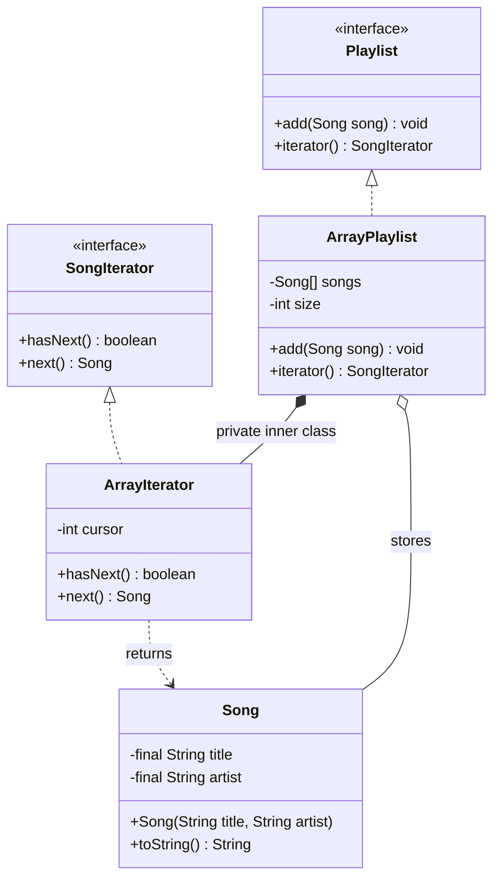

# Iterator — Class / ER Diagram

## Class / ER diagram



## The relationships in plain English

- **Two interfaces, one job.** The `Playlist` (the *aggregate*) knows how to produce an iterator; the `SongIterator` knows how to walk it (`hasNext` / `next`). The client depends on these two interfaces, never on the storage.
- **The iterator hides the storage.** `ArrayPlaylist` happens to use a plain array. Its iterator is a **private inner class** that can read that array directly — but the array itself is invisible to the outside. Swap the array for a linked list, a tree, or a DB cursor and the client's loop doesn't change one character.
- **The cursor lives in the iterator, not the collection.** Each iterator carries its own `cursor`, so you can have several iterators walking the same playlist independently — the demo proves two of them don't interfere.

The one-liner: Iterator gives you a *uniform way to traverse* any collection without exposing how it's built, and it moves the traversal state out of the collection and into a separate object.

ER framing: the collection is the table; the iterator is a *cursor* over it — the same idea as a database cursor that yields rows one at a time without you knowing the storage engine.

## The code

Implementation lives in [`src/`](src/). Compile and run the demo:

```bash
cd src && javac *.java && java Demo
# or from the repo root:  ./run.sh 14-iterator-pattern
```
